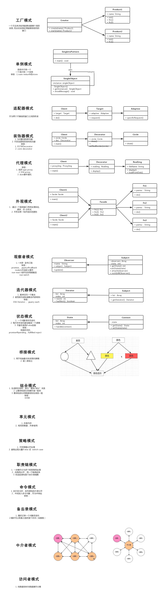

# JS设计模式讲解

### webpack中babel配置
webpack升级到4+之后， 相对应的一些插件配置在以前的基础上存在一些版本不兼容的情况，尤其是babel，因为babel的版本迭代十分迅速，经常出现error，大部分都是因为版本的问题导致的。

当前时间2019-03-18 ，采用此教程：[使用 Webpack 与 Babel 配置 ES6 开发环境](https://segmentfault.com/a/1190000018461758#articleHeader3)

## 设计模式

